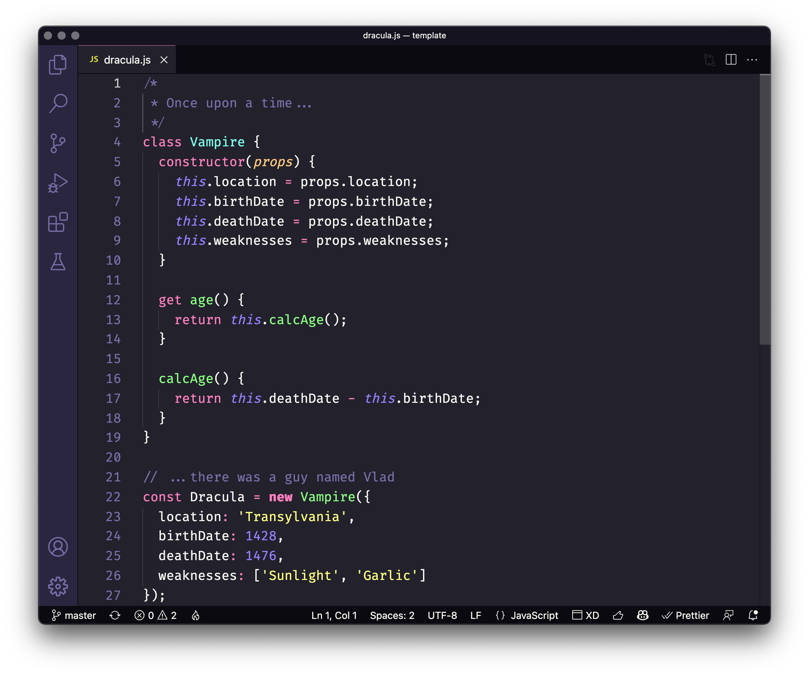

# Dracula for [Wikipedia](https://www.wikipedia.com)

> A dark theme for [Wikipedia](https://www.wikipedia.com).

## Install

All instructions can be found at [draculatheme.com/wikipedia](https://draculatheme.com/wikipedia).

## Team

This theme is maintained by the following person(s) and a bunch of [awesome contributors](https://github.com/dracula/wikipedia/graphs/contributors).

 |
--- |
[Wasi Master](https://github.com/wasi-master) |

## License

[MIT License](./LICENSE)